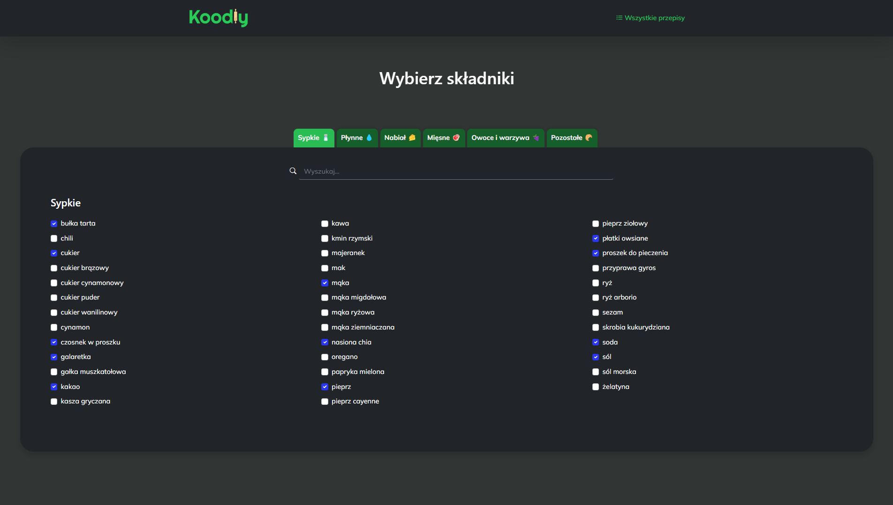
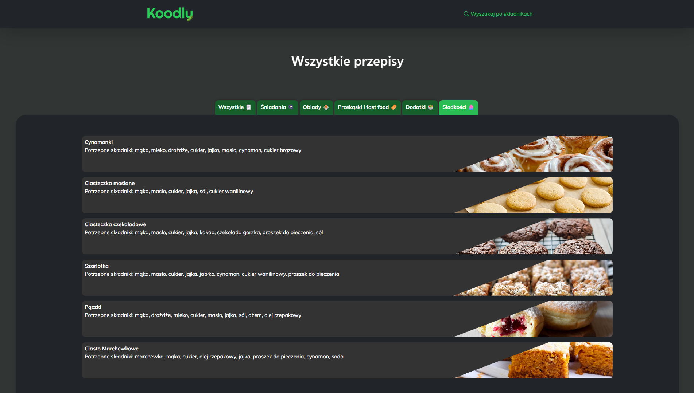
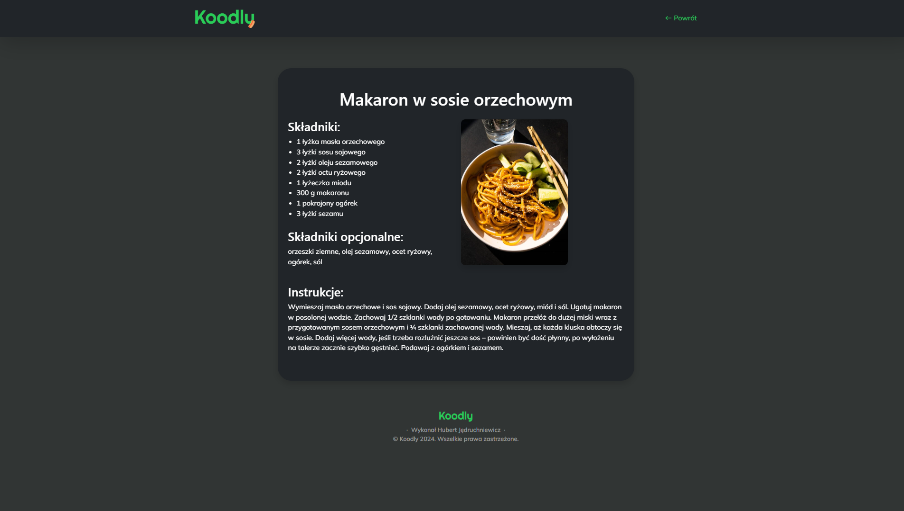
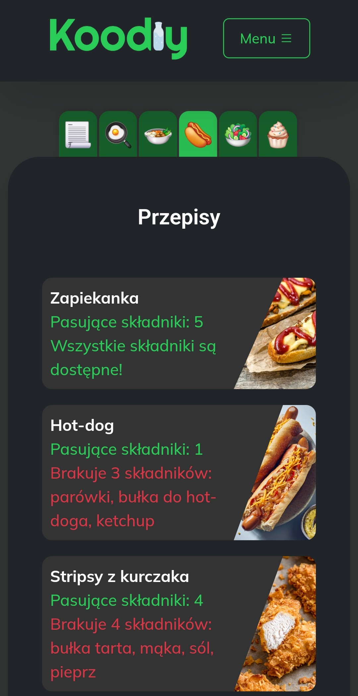
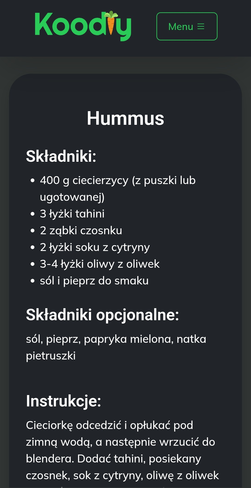

# Koodly - Web Application

  

## Table of Contents
- 🚀 [Project Overview](#project-overview)
- ✨ [Features](#features)
- 💻 [Technologies](#technologies)
- 📋 [Requirements](#requirements)
- 🛠️ [Setup Instructions](#setup-instructions)
- 📸 [Screenshots](#screenshots)

## Project Overview

**Koodly** is a web application that allows you to find the right recipe based on the ingredients you have on hand. **The website is only available in Polish language version!**

## Features

**User**

- 🔍 Ingredient search engine and categories, allowing you to find ingredients quickly and easily
- 📂 Recipe categories, allowing you to find the right food for the right occasion
- ⏱️ Counting for each recipe the number of matching and missing ingredients 
- 📖 Ability to preview all recipes

**Owner**
- ➕ Easy addition of new recipes and ingredients

**Other features**

- 📱 Full responsiveness

## Technologies

**Frontend:**
- Bootstrap
- HTML
- JavaScript

## Requirements
Software versions used for development (**compatibility with earlier versions has not been tested**):
- Bootstrap 5.0

## Setup Instructions

1. Download this repository.
2. Open the index.html file.

## Screenshots

  
  
  
  

### Mobile Device
 
